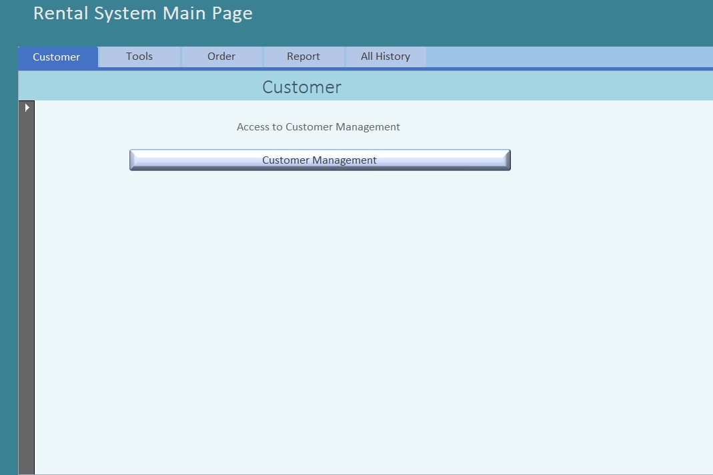

<h3>How does it work?</h3>

  •	Team worked with three classmates to create complex database applications, seamlessly integrating Microsoft Access with MS SQL and Oracle SQL Servers.  
  •	Implemented PL/SQL to develop instead of triggers to manage user INSERTS, UPDATES, and DELETES, recording data changes with timestamps in Oracle. 
  •	Made testing plan and generated test data to examine constraints and ensure triggers worked as required. 

 
<h3 align="left">Data Model 1</h3>

  

 
<h3 align="left">Data Model 2</h3>

  🚩 Add data history tracker trigger. 
  

 
<h3 align="left">How it looks like?</h3>

  

